# TryHackMe: Encryption - Crypto 101

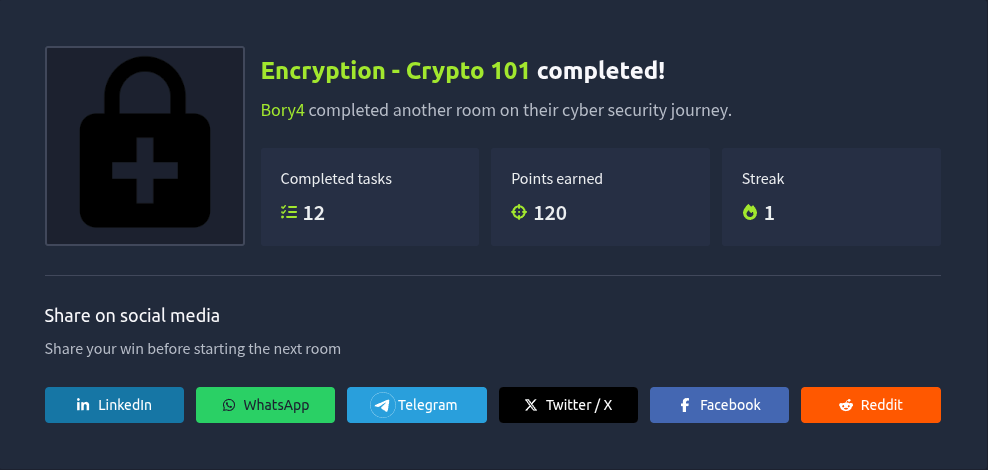

---

### Pytania i odpowiedzi

* **Are SSH keys protected with a passphrase or a password?** passphrase
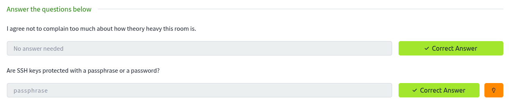

* **What does SSH stand for?** Secure Shell
* **How do webservers prove their identity?** certificates
* **What is the main set of standards you need to comply with if you store or process payment card details?** PCI-DSS
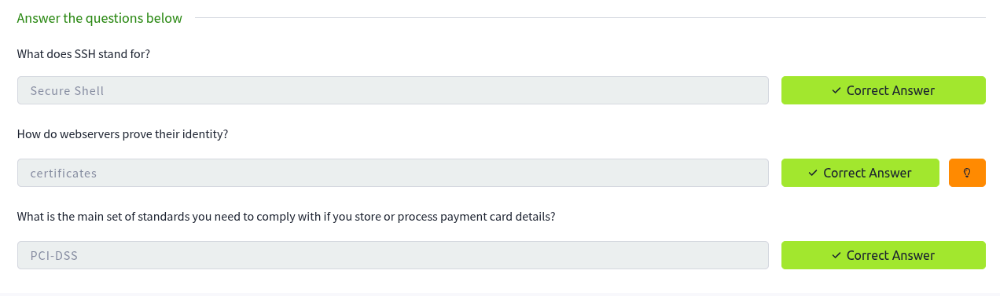

* **What's 30 % 5?** 0
* **What's 25 % 7?** 4
* **What's 118613842 % 9091?** 3565
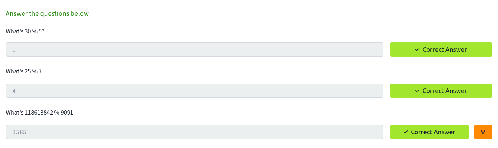

* **Should you trust DES? Yea/Nay:** Nay
* **What was the result of the attempt to make DES more secure so that it could be used for longer?** Triple DES
* **Is it ok to share your public key? Yea/Nay:** Yea
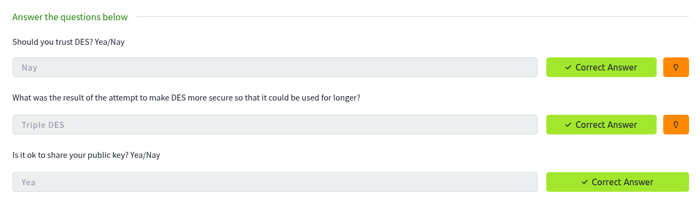

* **p = 4391, q = 6659. What is n?** 29239669
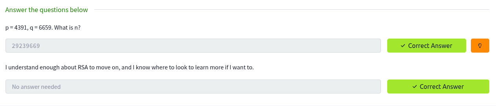

* **What can you use to verify that a file has not been modified and is the authentic file as the author intended?** Digital Signature
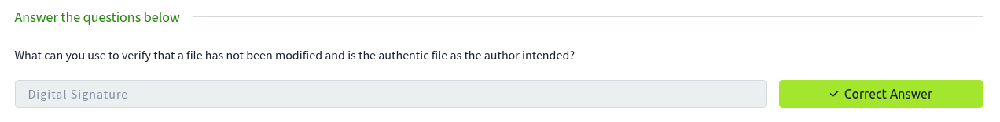

---

### Polecenia SSH

* Generowanie hasha z klucza prywatnego do formatu obsługiwanego przez John The Ripper:
  `/usr/share/john/ssh2john.py id_rsa_1593558668558.id_rsa`
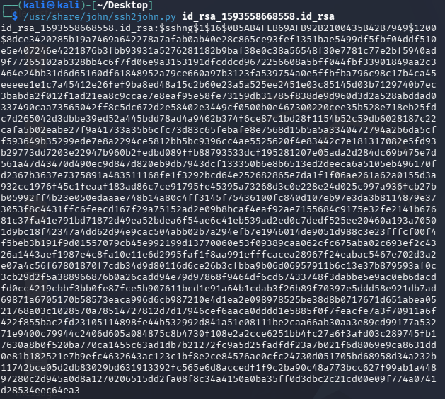

* Łamanie wygenerowanego hasha przy użyciu słownika rockyou.txt:
  `john --wordlist=/usr/share/wordlists/rockyou.txt --format=SSH ssh.hash`
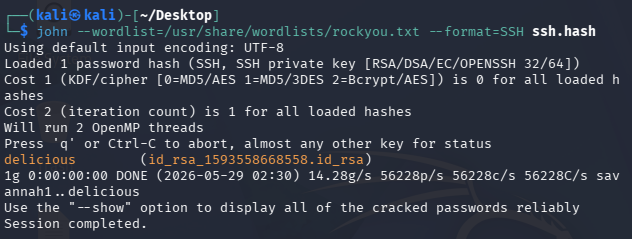

* **What algorithm does the key use?** RSA
* **Crack the password with John The Ripper and rockyou, what's the passphrase for the key?** delicious
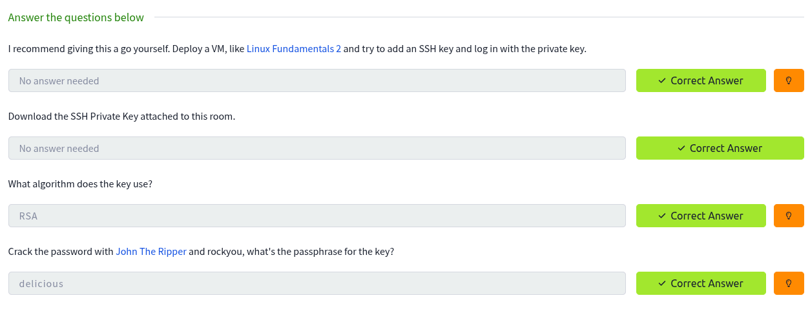

---

### Polecenia GPG

* Importowanie klucza:
  `gpg --import tryhackme.key`
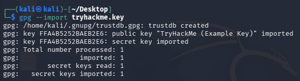

* Odszyfrowanie pliku wiadomości:
  `gpg --decrypt message.gpg`
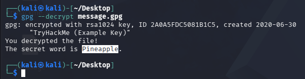

* **You have the private key, and a file encrypted with the public key. Decrypt the file. What's the secret word?** Pineapple
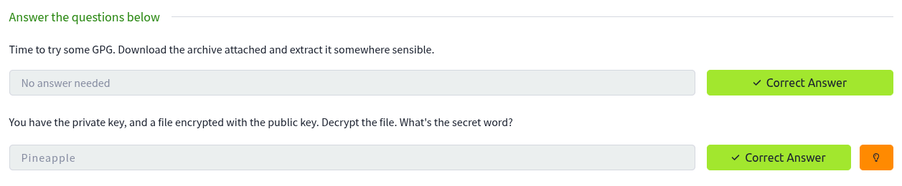

